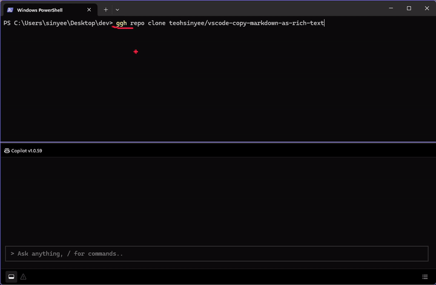

# Productivity Explore Inventory

A lightweight README-first inventory of productivity tools I test and share, across both AI and non-AI categories.

I test newly released tools that might improve productivity, both AI and non-AI, and share the ones that are worth a closer look.

If you are just browsing, you should be able to understand each tool from this page alone:
- what it does
- why it matters
- my quick verdict
- a screenshot or short recording

## Inventory

| Tool | What it does | Why it matters | Verdict | Media | Link |
| --- | --- | --- | --- | --- | --- |
| Microsoft Intelligent Terminal | An AI-assisted terminal that suggests follow-up commands when a command fails. | It removes the usual step of copying terminal errors into another AI tool, which can make command-line work less intimidating for beginners. | `Useful` |  [Watch full video](assets/videos/microsoft-intelligent-terminal.mp4) | [microsoft/intelligent-terminal](https://github.com/microsoft/intelligent-terminal) |

## Recently Added

- `2026-06-04` Microsoft Intelligent Terminal

## Quick Stats

| Metric | Value |
| --- | --- |
| Total tools | 1 |
| AI-related | 1 |
| Non-AI-related | 0 |
| With screenshots | 1 |
| With videos | 1 |

## How I Judge Tools

I focus on tools that help me move faster, reduce friction, or make it easier to share useful workflows with others.

- `Useful` = worth reusing and sharing
- `Promising` = strong idea, still early or needs more testing
- `Niche` = good for a specific workflow, not broadly useful
- `Skip` = tested, but not worth keeping in my stack
- `Revisit` = not ready to judge yet, or I want to retest later

## Notes

- This repo is an inventory, not a review blog.
- The README schema is intentionally lightweight and visitor-first.
- Readers should be able to understand the whole collection without opening subfolders.
