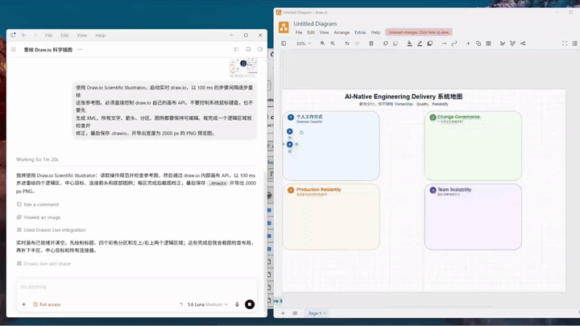

# Should You Try This Tool?

Curious about a new productivity tool? I probably tested it already.

New AI and non-AI productivity tools, tested with quick verdicts, previews, and links.

## Inventory

<table>
  <colgroup>
    <col style="width: 15%;">
    <col style="width: 25%;">
    <col style="width: 10%;">
    <col style="width: 50%;">
  </colgroup>
  <thead>
    <tr>
      <th>Tool</th>
      <th>Takeaway</th>
      <th>Verdict</th>
      <th>Media</th>
    </tr>
  </thead>
  <tbody>
    <tr>
      <td><a href="https://www.drawio.com/">Draw.io Scientific Illustrator</a> <code>Codex plugin</code></td>
      <td>Recreates reference images directly on the live draw.io canvas, so text, panels, connectors, and legends stay editable for later customization.</td>
      <td></td>
      <td> <a href="assets/videos/drawio-scientific-illustrator.mp4">Watch full video</a></td>
    </tr>
    <tr>
      <td><a href="https://github.com/microsoft/intelligent-terminal">Microsoft Intelligent Terminal</a> <code>microsoft/intelligent-terminal</code></td>
      <td>AI suggests a follow-up command when one fails, so beginners can recover faster without copying errors into another tool.</td>
      <td></td>
      <td> <a href="assets/videos/microsoft-intelligent-terminal.mp4">Watch full video</a></td>
    </tr>
  </tbody>
</table>

## Quick Stats

- 2 tools tested
- 2 tools with demo previews

## Recently Added

- `2026-07-22` Draw.io Scientific Illustrator
- `2026-06-04` Microsoft Intelligent Terminal

## Verdicts

-  = worth reusing and sharing
-  = strong idea, still early or needs more testing
-  = good for a specific workflow, not broadly useful
-  = tested, but not worth keeping in my stack
-  = not ready to judge yet, or I want to retest later
